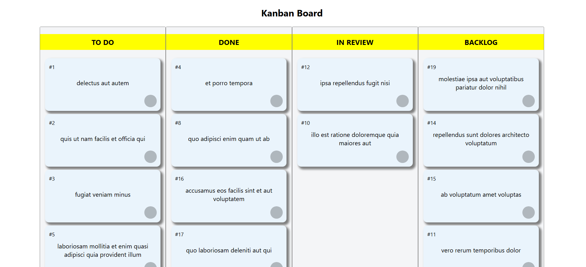

# KKB AKA Kanban Board

Welcome to my Kanban Board! This web application allows users to manage their tasks efficiently using the Kanban methodology. With a simple drag-and-drop interface, you can organize tasks into different columns representing various stages of your workflow, such as "To Do," "In Review," and "Backlog."

# Features:
Drag and Drop: Easily move tasks between columns to reflect their current status.

User-Friendly Interface: A clean and intuitive interface to enhance productivity.

# Getting Started:

Clone or download the repository.

Open in VS Code 

Install all the dependencies

Open in Local Host 3000

# Git Hub Repo Link 

https://github.com/CodeCourtAce/KKB.git

